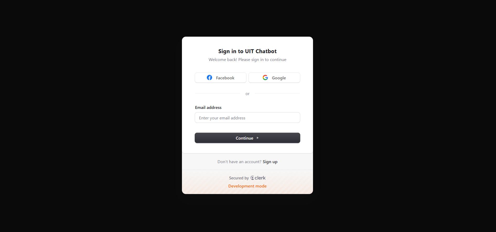
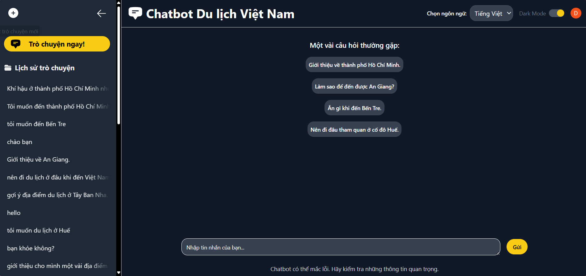
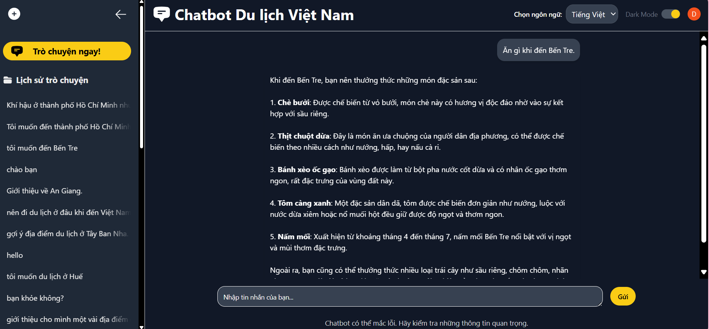

# 🇻🇳 TravelBot – Chatbot Du Lịch Việt Nam Thông Minh

**TravelBot** là hệ thống chatbot thông minh được thiết kế nhằm hỗ trợ người dùng tìm hiểu thông tin về **du lịch Việt Nam** – bao gồm các điểm đến nổi bật, món ăn địa phương, hoạt động vui chơi, và các mẹo du lịch hữu ích.

Hệ thống tích hợp công nghệ **truy xuất ngữ nghĩa (RAG)** kết hợp với mô hình ngôn ngữ lớn (LLM) nhằm cung cấp câu trả lời chính xác, thân thiện và dễ tiếp cận.

---

## 🧩 Thành phần hệ thống

- ✅ **Giao diện web thân thiện người dùng** (Next.js)
- ✅ **Xử lý hội thoại** với mô hình LLM kết hợp dữ liệu truy xuất (FastAPI)
- ✅ **Cơ chế truy xuất ngữ cảnh thông minh** từ kho dữ liệu du lịch Việt Nam
- ✅ **Phân loại small talk** và chuyển hướng hội thoại linh hoạt

---

## 🚀 Hướng dẫn sử dụng

### 1. Clone repository
```bash
git clone https://github.com/daoddp/vietnam-travel-chatbot.git
cd vietnam-travel-chatbot
```
### 2. Cài đặt thư viện cần thiết
```bash
pip install -r requirements.txt
```
#### Frontend (Next.js)
```bash
cd chatbot_frontend
npm install
```
### 3. Thiết lập biến môi trường
#### Backend
Tạo file `.env` trong thư mục `chatbot_retrieve/` với nội dung như sau:
```bash
OPENAI_API_KEY="YOUR_OPEN_API_KEY"
```
#### Frontend
Tạo file `.env` trong thư mục `chatbot_frontend/` với nội dung như sau:
```bash
DATABASE_URL="YOUR_MONGODB_URL"
NEXT_PUBLIC_CLERK_PUBLISHABLE_KEY="YOUR_CLERK_KEY"
CLERK_SECRET_KEY="YOUR_CLERK_SECRET_KEY"
```
#### ⚠️ Lưu ý:
- Bạn cần có tài khoản MongoDB Atlas và đã tạo 1 cluster cùng database.
- Bạn cần tạo API_KEY từ OPENAI (có thể tự phát triển LLM khác như Gemini,... để tối ưu chi phí).

### 4. Chạy giao diện người dùng (frontend)
```bash
cd chatbot_frontend
npm run dev
```
Ứng dụng sẽ chạy tại: http://localhost:3000
### 5. Chạy server xử lý chatbot (backend)
```bash
cd ../chatbot_retrieve
uvicorn main:app --host 0.0.0.0 --port 8000 --reload
```
Docs API sẽ có tại: http://localhost:8000/docs

# 🌐 Một số ảnh giao diện
### 🧑‍💼 Giao diện đăng nhập

### 💬 Giao diện chatbot


